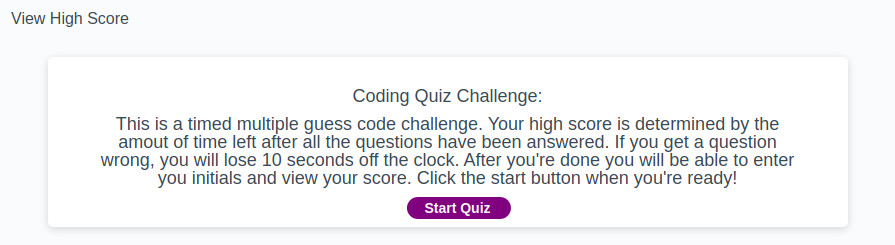
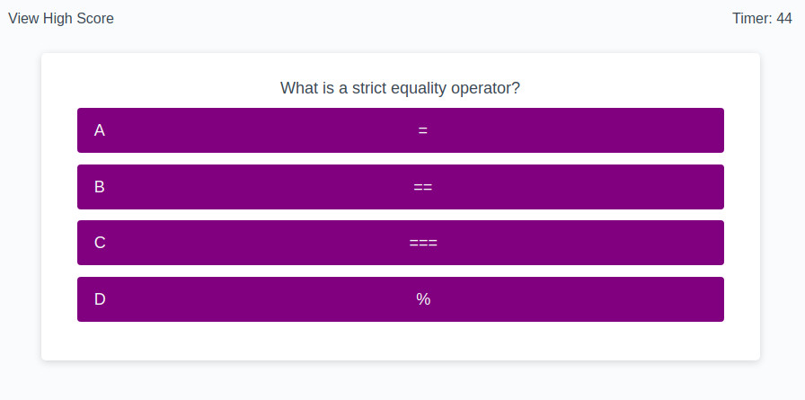
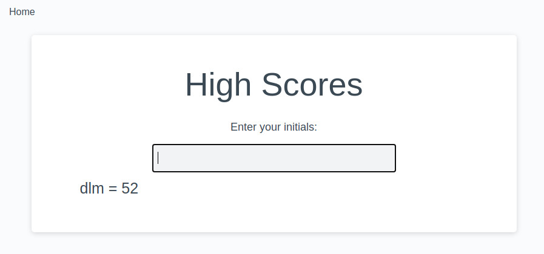

# Homework week 4 | Code Quiz

This week I created a javascript quiz game. The score is determined by the amount of time remaining after all the question have been answered. If you get a wrong answer 10 seconds will be deducted from the timer. Good Luck!

## Some features of the Code Quiz:

* After the start button is clicked the user is taken to the first question and a 60sec timer starts
* Correct answers are highlighted green, incorrect turn red
* Incorrect answers result in a loss of 10 seconds
* After all the questions are answered, the user is taken to the high score page
* The user can enter their initals to see their initals and score displayed on the page

## Screenshots of the Code Quiz app

## Author

    Dave Murphy